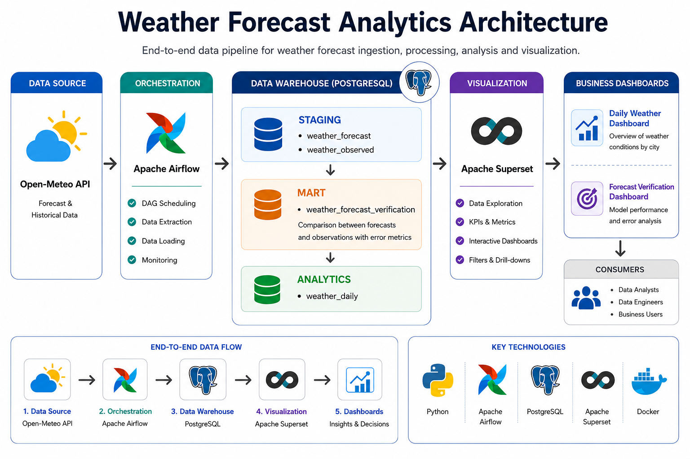
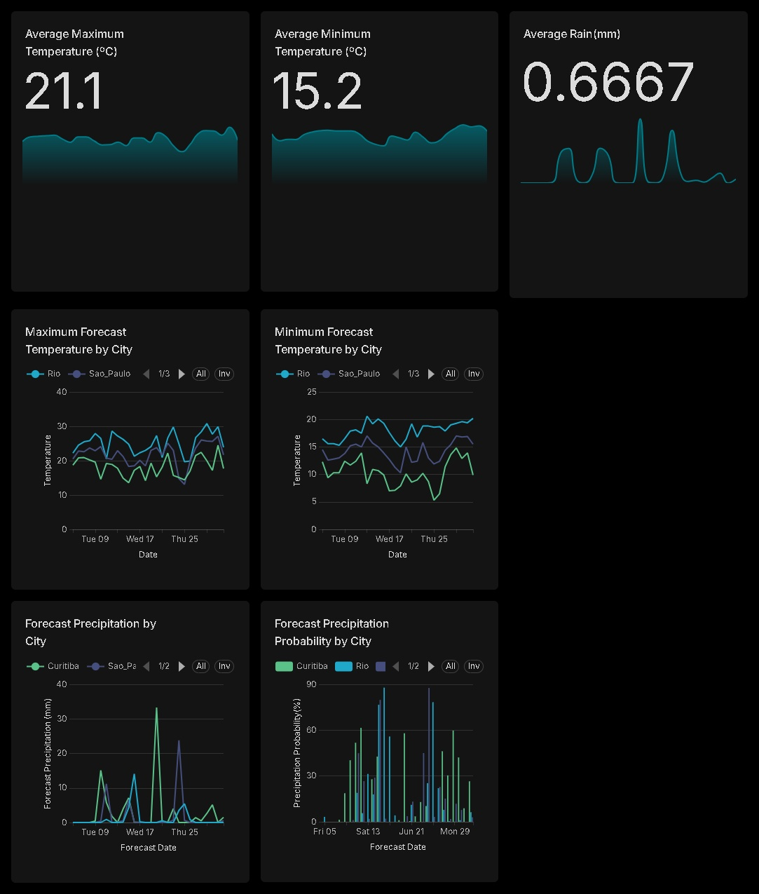
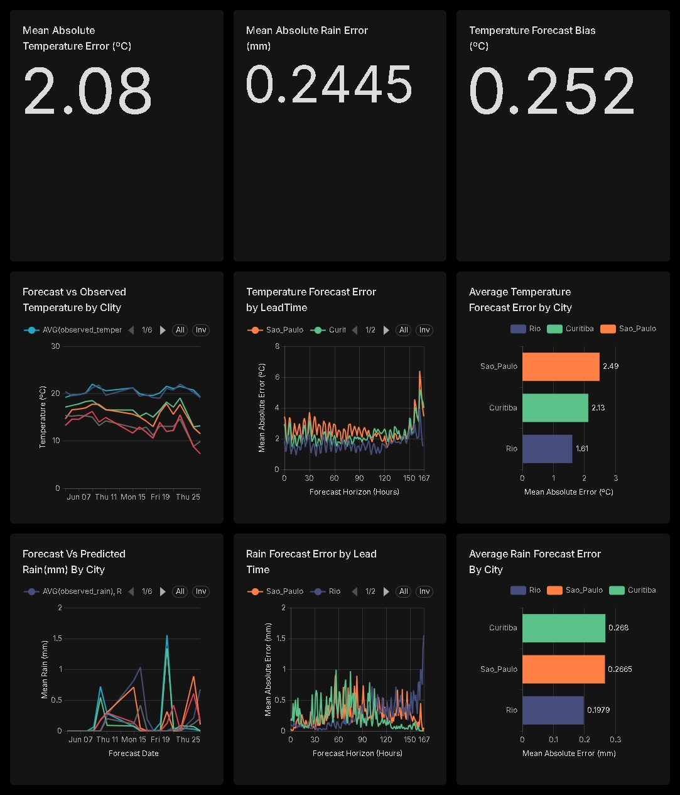

# Weather Forecast Analytics

> End-to-end Data Engineering project for weather forecasting analytics and forecast quality monitoring.

## Overview

**Weather Forecast Analytics** is an end-to-end data pipeline designed to ingest, transform, store, and visualize weather forecast data while evaluating the quality of predictions against observed weather conditions.

The project demonstrates a modern Data Engineering workflow using containerized services, orchestration, dimensional data modeling, and Business Intelligence dashboards.

---
## Project Highlights

- End-to-end weather data pipeline
- Automated orchestration with Apache Airflow using dataset-driven workflows
- Layered PostgreSQL data warehouse
- Forecast verification using observed weather data
- Interactive Apache Superset dashboards
- Dockerized development environment

---
# Data Sources

Weather data is collected from the Open-Meteo API:

- Forecast data: weather forecast models
- Observed data: historical weather observations

The pipeline processes multiple locations to generate analytical datasets and forecast verification metrics.

---
# Architecture

The solution follows a modern end-to-end data engineering architecture, orchestrating weather data ingestion, transformation, storage, and visualization through a layered PostgreSQL warehouse and Apache Superset dashboards.



---
# Tech Stack

| Component             | Technology              |
| --------------------- | ----------------------- |
| Programming Language  | Python                  |
| Orchestration         | Apache Airflow          |
| Database              | PostgreSQL              |
| Business Intelligence | Apache Superset         |
| Containerization      | Docker & Docker Compose |
| Transformations       | SQL                     |
| Version Control       | Git & GitHub            |

---
# Project Structure

```text
weather-forecast-analytics
├── dags/                 # Airflow DAGs
├── etl/                  # ETL modules
├── sql/                  # Database scripts
├── docker/               # Docker environment
├── docs/
│   └── images/
├── README.md
└── requirements.txt
```

---
# Pipeline Airflow

<p align="center">
  
</p>

---
# Data Pipeline

The pipeline performs the following steps:

1. Extract weather forecast data
2. Extract observed weather data
3. Load raw datasets into PostgreSQL
4. Transform and standardize the data
5. Build analytical marts
6. Generate forecast quality metrics
7. Visualize results in Superset dashboards

---
# Data Model
The data model follows a layered architecture designed to ensure data quality, traceability, and efficient analytical reporting. Weather data progresses through multiple stages, from raw API ingestion to business-ready datasets consumed by Apache Superset dashboards.

The architecture is organized into four logical layers:

## RAW

The RAW layer stores the original responses retrieved from the Open-Meteo API without any business transformations.

It preserves the complete JSON payload together with ingestion metadata, providing:

- Complete data lineage
- Historical traceability
- Payload deduplication using hashes
- Reliable reprocessing capabilities

**Tables**  

- `raw.weather_forecast`
- `raw.weather_observed`

## STAGING

The STAGING layer transforms raw JSON payloads into structured relational tables.

During this stage, nested weather variables are extracted, standardized, validated, and prepared for downstream analytical processing.

**Tables**

- `staging.weather_forecast`
- `staging.weather_observed`

## MART

The MART layer contains curated datasets designed for analytical consumption.

It includes:

- **Weather Forecast** — standardized forecast datasets.
- **Weather Forecast Verification** — comparison between forecast and observed weather conditions, including forecast timing, lead time, and forecast verification metrics.

**Tables**

- `mart.weather_forecast`
- `mart.weather_forecast_verification`

## ANALYTICS

The ANALYTICS layer provides business-oriented datasets optimized for dashboards and reporting.

The `analytics.weather_daily` dataset aggregates daily forecast information, including temperature statistics, precipitation probability, and rainfall metrics, enabling fast dashboard queries in Apache Superset.

**Tables**

- `analytics.weather_daily`

Design Note: The separation between RAW, STAGING, MART, and ANALYTICS follows modern data engineering practices, improving maintainability, auditability, and scalability while keeping analytical datasets optimized for business intelligence and forecast verification.

<p align="center">
  
</p>

---
# 📈 Dashboards

Apache Superset is used to provide interactive dashboards for weather monitoring, forecast exploration, and forecast verification.

All dashboards support interactive filtering by City and Forecast Date, allowing users to explore weather conditions and forecast verification results dynamically.

The dashboards are built on the analytical datasets generated by the pipeline and enable users to:

- Monitor daily weather conditions by city
- Analyze forecast temperature trends
- Explore precipitation forecasts
- Compare precipitation probability across locations
- Evaluate forecast quality using verification metrics

## Weather Forecast Analysis

Built on the **analytics.weather_daily** dataset, this dashboard provides an overview of weather conditions across multiple cities.

### KPIs

* Average Maximum Temperature (°C)
* Average Minimum Temperature (°C)
* Average Rain (mm)

### Visualizations

* Maximum Temperature by City (°C)
* Minimum Temperature by City (°C)
* Precipitation by City (mm)
* Precipitation Probability by City (%)

<p align="center">
  
</p>

## Forecast Model Performance Analysis

The Forecast Verification Dashboard provides a comprehensive evaluation of forecast performance by comparing predicted weather conditions against observed measurements.

Built on the **mart.weather_forecast_verification dataset**, it enables users to monitor forecast quality, identify systematic biases, and analyze how forecast accuracy changes across cities and forecast lead times.

This dashboard supports forecast verification, model performance analysis, and continuous monitoring of prediction quality, providing actionable insights for evaluating weather forecasting reliability.


### Mean Absolute Temperature Error (MAE)

Measures the average magnitude of prediction errors.

```
MAE = AVG(ABS(predicted_temperature - observed_temperature))
```

Lower values indicate better model performance.


### Mean Absolute Rain Error

Measures the average difference between predicted and observed precipitation.

```
MAE_rain = AVG(ABS(predicted_rain - observed_rain))
```

### Temperature Forecast Bias

Measures whether the model systematically overestimates or underestimates temperature.

```
Bias = AVG(predicted_temperature - observed_temperature)
```

Interpretation:

* Positive → model tends to overestimate temperature
* Negative → model tends to underestimate temperature
* Zero → unbiased predictions


### Visualizations


  * Forecast vs Observed Comparison - Side-by-side comparison of forecasted and observed 
temperature and rainfall across multiple cities.
  * Lead Time Analysis – Evaluation of forecast error as the forecast horizon increases, helping 
assess model degradation over time.
  * City-Level Performance – Comparison of forecast errors between cities, highlighting spatial 
differences in forecast performance.


<p align="center">
  
</p>

---
# Learning Objectives

This project demonstrates practical experience with:

* ETL pipeline development
* Workflow orchestration
* SQL-based data transformations
* Analytical data modeling
* Business Intelligence dashboards
* Forecast quality monitoring
* Containerized development environments

---
# Future Improvements

* dbt integration for data transformations
* Automated data quality tests
* CI/CD pipeline
* Unit and integration testing
* Cloud deployment

---
# Running Locally

### Installation

1. Clone the repository:
    ```bash
    git clone https://github.com/DedeEstevao/weather-forecast-analytics.git
    ```
2. Navigate to the project directory:
    ```bash
    cd weather-forecast-analytics
    ```
3. Initialize the environment:
    ```bash
    ./scripts/setup.sh
    ```
4. Available Services:

    After the containers are running, the following services are available:

    | Service | URL | Purpose |
    |----------|-----|---------|
    |   **Apache Airflow** | http://localhost:8080 | Pipeline orchestration and monitoring |
    |   **Apache Superset** | http://localhost:8088 | Weather analytics and forecast verification   dashboards |
    |   **PostgreSQL** | localhost:5432 | Layered analytical data warehouse |

5. Default credentials (local development only):

    | Service | Username | Password |
    |---------|----------|----------|
    | Airflow | admin | admin |
    | Superset | admin | admin |
    **Note:** These credentials are intended exclusively for local development and demonstration purposes.
  
  
  ### First Run

  1. Run `infra_postgres_setup` DAG.
  2. Run the `bootstrap_open_meteo` DAG to load historical RAW data (optional).
  
      To facilitate dashboard exploration, the RAW layer can be initialized with previously collected historical Open-Meteo data.

      These datasets are used only for environment bootstrap purposes and allow users to visualize the complete pipeline flow, from ingestion through to the analytical layers.

  3. Wait for downstream DAGs triggered by Airflow Datasets.
  4. Access Superset dashboards.

      - Open Superset (http://localhost:8088).

      - Log in as `admin`.

  5. Importing Superset Dashboards:

      - Go to **Settings → Import/Export** (or the corresponding menu in your version).

      - Import the files from the `dashboards/` directory.

---
# Author

Data Engineering portfolio project focused on modern data pipelines, workflow orchestration, analytical modeling, and forecast quality monitoring using Airflow, PostgreSQL, and Apache Superset.
